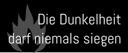

# Die Dunkelheit darf niemals siegen

This is a tribute to the [Frittenbude song with the same name](https://soundcloud.com/frittenbude/die-dunkelheit-darf-niemals) which has stuck in my head for a fair bit. A literal translation could be “The darkness must never win”, which could be interpreted as a call to never give up and lose hope, or in context to the lyrics to never stop fighting against racism, discrimination and fascists which are on the rise again.

The flame is taken from the set of [Globally Harmonized System pictograms](https://unece.org/transport/dangerous-goods/ghs-pictograms) (via [the SVG from the Wikimedia Commons](https://commons.wikimedia.org/wiki/File:GHS-pictogram-flamme.svg)) which are public domain. The burning match from other variants is taken from the [D-P002](https://commons.wikimedia.org/wiki/File:DIN_4844-2_D-P002.svg) sign (DIN 4844-2) which is also public domain.

The font used is [Abel](https://fonts.google.com/specimen/Abel).

I dedicate this “work” to the public domain via [CC0 1.0](https://creativecommons.org/publicdomain/zero/1.0/deed.en) ([full license text](legalcode.txt)).

Variant 4 is what I printed for 37C3 in a small number.
