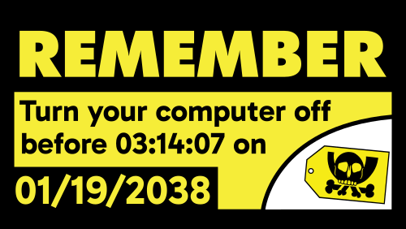
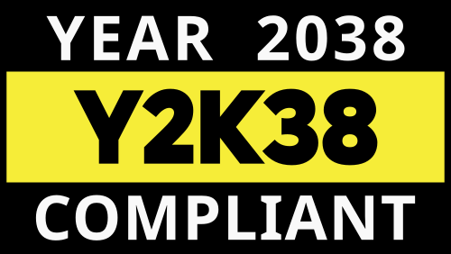

# Y2K38

The “Y2K” scare was a world-wide panic around a problem caused by the bad programming practice of using two-digit variables like `97` for the year of a timestamp for example, without accounting for the year 2000 onwards. You can read more about it [here](https://en.wikipedia.org/wiki/Year_2000_problem). In January 2038, [we might encounter a similar problem](https://en.wikipedia.org/wiki/Year_2038_problem).

**The “Pesthörnchen” is only to be used for non-commercial, Chaos-internal purposes**, see [its reference in the Hacker Archive](https://hacker-archive.org/ark:/45490/bhUbiG). Since I’m distributing the stickers free of charge at Chaos events, my use of it here complies with that restriction.

Apart from that, the work is dedicated by me to the public domain under [CC0 1.0 Universal ](https://creativecommons.org/publicdomain/zero/1.0/deed.en) ([full license text](legalcode.txt)).

The fonts used are [Gabarito](https://fonts.google.com/specimen/Gabarito) and whatever my system’s default Sans Serif font is (probably Open Sans or so).

## Remember to turn off your computer

This one is a direct reference to the [Best Buy sticker from the late 90s](https://commons.wikimedia.org/wiki/File:Best_Buy_-_Turn_your_computer_off_before_midnight_Y2K_Sticker.png), which is in the public domain (although the Best Buy logo in that version is obviously restricted in its use by being a Trademark).

I adapted this to be printed on Din A8 format for better printing prices and had to do some trade-offs there, especially with the white bottom-right corner.

## Device Compliant

This one is a play on the graphic on the sticker depicted [here](https://commons.wikimedia.org/wiki/File:KVM_Switch_-_Y2K_(524668420).jpg).

I adapted it for printing on a square-shaped sticker, but last-minute decided against printing it for 37C3.
